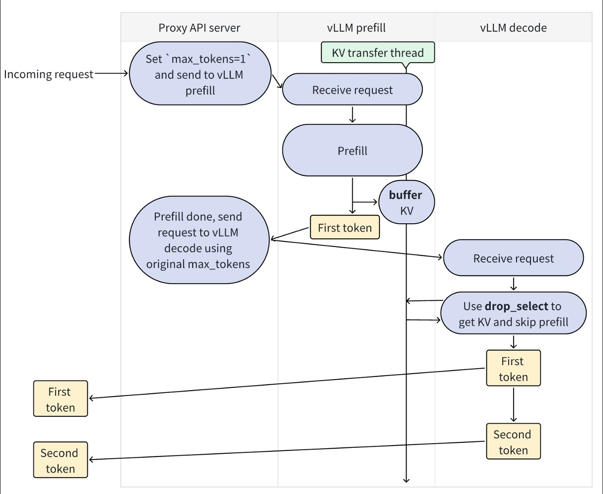

{ #disagg-prefill }

This page introduces you the disaggregated prefilling feature in vLLM.

!!! note
    This feature is experimental and subject to change.

## Why disaggregated prefilling?

Two main reasons:

- **Tuning time-to-first-token (TTFT) and inter-token-latency (ITL) separately**. Disaggregated prefilling put prefill and decode phase of LLM inference inside different vLLM instances. This gives you the flexibility to assign different parallel strategies (e.g. `tp` and `pp`) to tune TTFT without affecting ITL, or to tune ITL without affecting TTFT.
- **Controlling tail ITL**. Without disaggregated prefilling, vLLM may insert some prefill jobs during the decoding of one request. This results in higher tail latency. Disaggregated prefilling helps you solve this issue and control tail ITL. Chunked prefill with a proper chunk size also can achieve the same goal, but in practice it's hard to figure out the correct chunk size value. So disaggregated prefilling is a much more reliable way to control tail ITL.

!!! note
    Disaggregated prefill DOES NOT improve throughput.

## Usage example

Please refer to <gh-file:examples/online_serving/disaggregated_prefill.sh> for the example usage of disaggregated prefilling.

## Benchmarks

Please refer to <gh-file:benchmarks/disagg_benchmarks> for disaggregated prefilling benchmarks.

## Development

We implement disaggregated prefilling by running 2 vLLM instances. One for prefill (we call it prefill instance) and one for decode (we call it decode instance), and then use a connector to transfer the prefill KV caches and results from prefill instance to decode instance.

All disaggregated prefilling implementation is under `vllm_logits/distributed/kv_transfer`.

Key abstractions for disaggregated prefilling:

- **Connector**: Connector allows **kv consumer** to retrieve the KV caches of a batch of request from **kv producer**.
- **LookupBuffer**: LookupBuffer provides two API: `insert` KV cache and `drop_select` KV cache. The semantics of `insert` and `drop_select` are similar to SQL, where `insert` inserts a KV cache into the buffer, and `drop_select` returns the KV cache that matches the given condition and drop it from the buffer.
- **Pipe**: A single-direction FIFO pipe for tensor transmission. It supports `send_tensor` and `recv_tensor`.

!!! note
    `insert` is non-blocking operation but `drop_select` is blocking operation.

Here is a figure illustrating how the above 3 abstractions are organized:

The workflow of disaggregated prefilling is as follows:

The `buffer` corresponds to `insert` API in LookupBuffer, and the `drop_select` corresponds to `drop_select` API in LookupBuffer.

## Third-party contributions

Disaggregated prefilling is highly related to infrastructure, so vLLM relies on third-party connectors for production-level disaggregated prefilling (and vLLM team will actively review and merge new PRs for third-party connectors).

We recommend three ways of implementations:

- **Fully-customized connector**: Implement your own `Connector`, and call third-party libraries to send and receive KV caches, and many many more (like editing vLLM's model input to perform customized prefilling, etc). This approach gives you the most control, but at the risk of being incompatible with future vLLM versions.
- **Database-like connector**: Implement your own `LookupBuffer` and support the `insert` and `drop_select` APIs just like SQL.
- **Distributed P2P connector**: Implement your own `Pipe` and support the `send_tensor` and `recv_tensor` APIs, just like `torch.distributed`.
